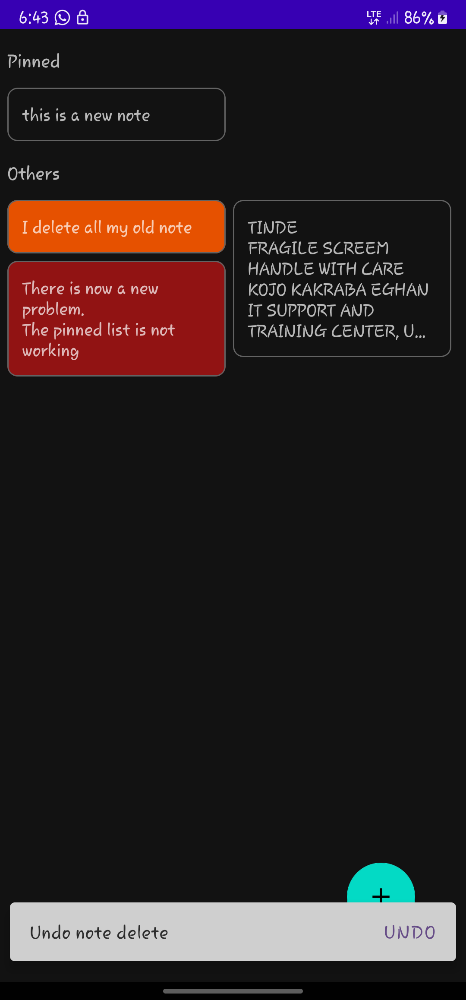
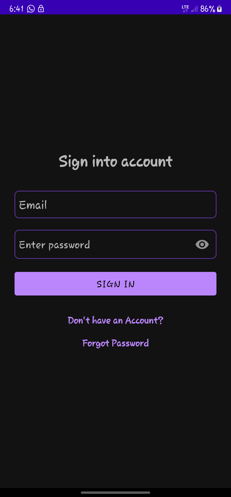
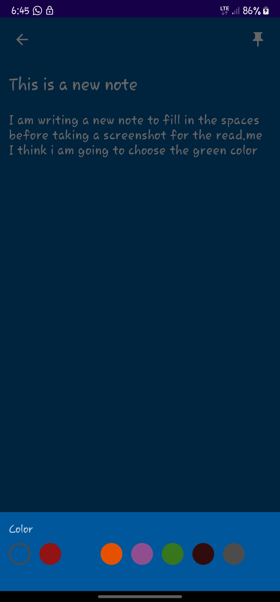
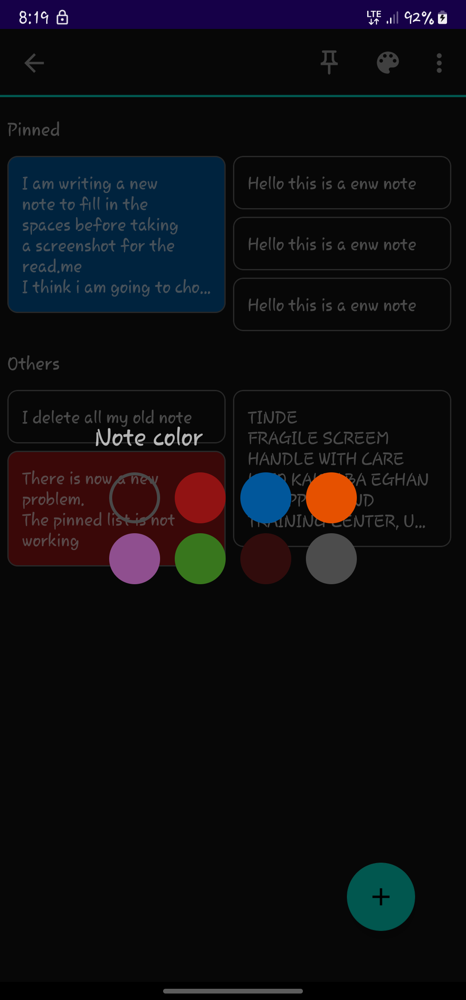

# Firenote
Firenote is a personal study project built to mimic the functionality of Google keep.
It is built using Kotlin and Firebase Realtime database and Auth. This is an educational project built to increase my own competency therefore won't be published or have extended support.
Note that information saved using this app doesn't have stringent encryption and should be used with that in mind.

## Table of contents
1. [Demo](#demo)
2. [Screenshots](#screenshots)
3. [Tech Stack](#tech-stack)
4. [Features](#features)
5. [Development Setup](#development-setup)
6. [License](#license)

## Demo
https://github.com/keeghan/FireNote/assets/40280581/25e95812-c79e-41ab-8343-f37132f8b4a4

## Screenshots

  
  
  
  

## Tech Stack
- [Kotlin](https://kotlinlang.org/) as sole Language.
- [Firebase Android](https://firebase.google.com/docs/android/setup) for authentication and realtime database storage.
- [RecyclerViewSwipeDecorator](https://github.com/xabaras/RecyclerViewSwipeDecorator) for adding sytle to note's swipe to delete.
- [SDP and SSP](https://github.com/intuit/sdp) for pixel-independent scaling and spacing.
- [Google Play Services](https://developers.google.com/android/guides/setup) for firebase support and other services.

 

 ## Features
 - Create an account with a valid email
 - Password recovery
 - Save note and change note color, tilte and message.
 - Pin and unpin notes.
 - Share note messge with other apps

 

## Development Setup
Make sure you have downloaded and setup the Android Studio SDK correctly before you begin on this project. Here is the Android Studio documentation to guide you through it: [Android Studio Setup](http://developer.android.com/sdk/installing/index.html?pkg=studio)

### Building and Running
1. Follow this process to create a firebase project to link the app [Link](https://firebase.google.com/docs/android/setup#console).
2. Replace the [google-services.json](app/google-services.json) file so that it writes to the realtime database of your own project.
3. Doing this will also allow you to manage user authentications. [Link](https://firebase.google.com/docs/auth/android/manage-users)

> The default google-services.json has been provided in this project so that you run this app without having to fully manage your own firebase backend. I however recommended that you setup your firebase console to take greater advantage of this project.

## License
[MIT](https://choosealicense.com/licenses/mit/)
